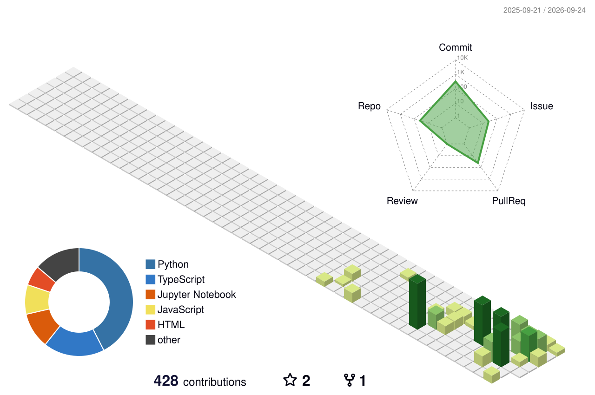

---

### 3D Contribution Calendar

---

### Organizations

---

### Activity Overview

---

### Contribution Activity

---

### Activity Graph

---

### Tech Stack

---

### Profile Views

---

### GitHub Trophies

---

### Recently worked with

---

### Support

---

